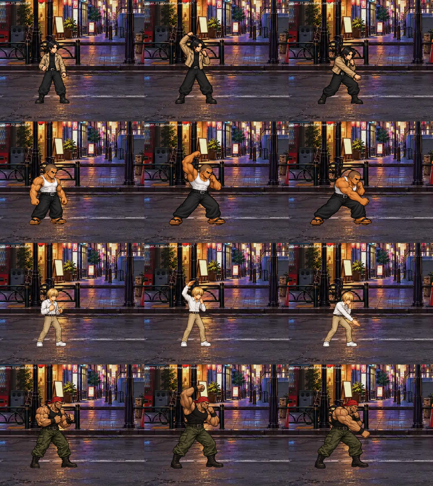

# 第1ステージ：デザインを優先した連続攻撃

対象はアッキー、ゴウ、セイヤ、クラッシャー。作業用ブランチ `codex/normal-combo-20261011`。公開ビルドには未反映。

左右交互の攻撃は必須にしない。現在の基本デザイン、頭・胴体・手足の比率、同じ動作内の攻撃腕の連続性を優先する。セイヤは現行の細身アトラスを基準とし、クラッシャーの赤いニット帽も維持する。

通常連続技の大部分は、正式アトラスの既存画像をそのまま参照する。ゴウの2段目には前方パンチを使用。アッキーの重複していた2段目には新しい接触姿勢を追加し、準備・復帰は正式素材から接続する。新規打ち下ろしは4人それぞれの基本画像を参照して生成。生成素材には1素材につき同じ倍率だけを使い、ポーズごとの拡大縮小はしない。

| キャラ | パンチ | キック |
|---|---:|---:|
| アッキー | 3 | 2 |
| ゴウ | 2 | 2 |
| セイヤ | 4 | 3 |
| クラッシャー | 2 | 2 |

P→P→Kの混合ルートも維持。通常連続技の最後はダウンを強制せず、被弾硬直を攻撃側の残り硬直とヒットストップ差に合わせる。ガードされた場合は連続技を止めて反撃可能な硬直を設ける。↓＋Pが打ち上げ、向きに対する後ろ＋Pが打ち下ろし。

## 確認結果

- `NORMAL_CHAINS_CHECK cases=8 failures=[]`：登録、段数、異なる接触画像、表示倍率、混合ルート、ガード硬直、入力データ、最後の回復差が1物理フレーム以内。
- `NORMAL_CHAINS_LIVE_CHECK failures=[]`：実際の物理当たり判定で純P・純K・P/P/Kを確認。入力からの打ち下ろしがしゃがんだ相手に当たり、↓Pで相手が上昇することも確認。
- `NORMAL_CHAINS_RENDERED_OK`：通常Godot描画で各フレームを保存し、4人の通常姿勢と新規姿勢を目視比較。
- `COMBAT_COMMAND_BUFFER_CHECK failures=[]`。

これは自動対戦・描画確認。手動の対戦操作、実機スマートフォン、公開Webでの確認は未実施。起動終了時にObjectDBのリーク警告が残っている。第4ステージ通し回帰は実行上限までに完了表示が得られず、成功扱いにはしていない。

この記録は第1ステージの確認時点のもの。第2〜第5ステージは追加作業済みで、結果は [追加確認記録](../normal_chains_stages2_5/REVIEW.md) を参照。既存の正式画像は上書きしていない。

## 表示比較

左から通常姿勢、打ち下ろし準備、打ち下ろし接触。同じカメラ・床位置のゲーム描画。

各コンボ接触姿勢： [アッキー](player_01_akky_review.jpg)、[ゴウ](player_02_gou_review.jpg)、[セイヤ](player_03_seiya_review.jpg)、[クラッシャー](enemy_01_crusher_review.jpg)。
