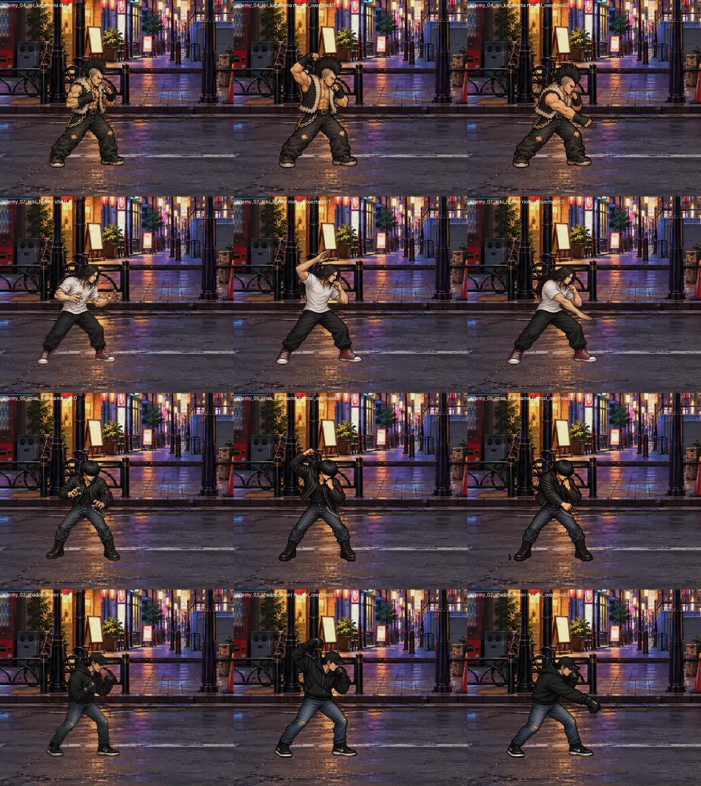

# 第2〜第5ステージ：連続技とデザイン確認

第1ステージと同じ作業用ブランチ `codex/normal-combo-20261011` に実装。現在の正式素材を参照し、既存の画像は上書きしていない。公開ビルドは未更新。

| ステージ | 敵 | 通常パンチ | 通常キック |
|---|---|---:|---:|
| 2 | レイ・カゲヤマ | 3段 | 2段 |
| 3 | テキ・ファイター | 3段 | 2段 |
| 4 | クロス・ムラサメ | 3段 | 2段 |
| 5 | シャドウボクサー | 4段 | 3段 |

各段は違う接触画像。通常連続技は正式アトラスの画像を組み合わせ、P→P→Kの混合ルートも維持。シャドウの旧キック名にはパンチ画像が含まれていたため、実際の蹴り姿勢を選び直した。近距離から長いリーチの段へつなぐ際の空振りを解消するため、最大リーチは保ったまま伸ばす腕・脚の区間にも当たり判定を設定した。画像や手足の長さは変えていない。

↓＋Pが打ち上げ、向きに対する後ろ＋Pがしゃがみ相手への打ち下ろし。新しい打ち下ろしは、レイの拳、テキの掌、クロスの肘、シャドウのグローブという違いを付けた。

左右交互は必須にせず、基本デザインと同じ動作内での攻撃腕の一貫性を優先。レイの初回生成にあった腕の入れ替わりを修正した。各生成素材は頭から床までの寸法を基準に、準備・接触の両方に同じ倍率を使う。ポーズごとの倍率変更は行わない。

## 確認範囲

第1ステージの3人とクラッシャーも含めた8人を確認。

- `NORMAL_CHAINS_CHECK cases=16 failures=[]`：段数、登録、異なる接触画像、表示倍率、混合ルート、ガード硬直、最後の回復差が1物理フレーム以内。
- `NORMAL_CHAINS_LIVE_CHECK failures=[]`：実際の物理当たり判定で純P、純K、P/P/K、被弾中の反撃阻止、ガードでの中断と反撃命中、入力からのしゃがみ相手への打ち下ろし・打ち上げを確認。
- `NORMAL_CHAINS_RENDERED_OK`：通常Godot描画で各フレームを保存。通常姿勢、準備、接触と各コンボ段を目視比較。
- `COMBAT_COMMAND_BUFFER_CHECK failures=[]`。

手動の通しプレイ、スマートフォン実機、公開Webでの確認は未実施。テスト終了時にObjectDBリーク警告が残る。第6ステージ以降は今回の変更対象外。

## ゲーム描画

左から通常姿勢、打ち下ろし準備、接触。同じ床とカメラ。

コンボ接触姿勢： [レイ](enemy_04_rei_kageyama_contacts.jpg)、[テキ](enemy_07_teki_fighter_contacts.jpg)、[クロス](enemy_05_cross_murasame_contacts.jpg)、[シャドウ](enemy_02_shadow_boxer_contacts.jpg)。

生成条件：[prompts.json](prompts.json)。採用素材は `godot/assets/characters/overhead_v1/{rei,teki,cross,shadow}/` に保存。`packing_manifest.json` に倍率・切り出し領域・床位置を記録。
